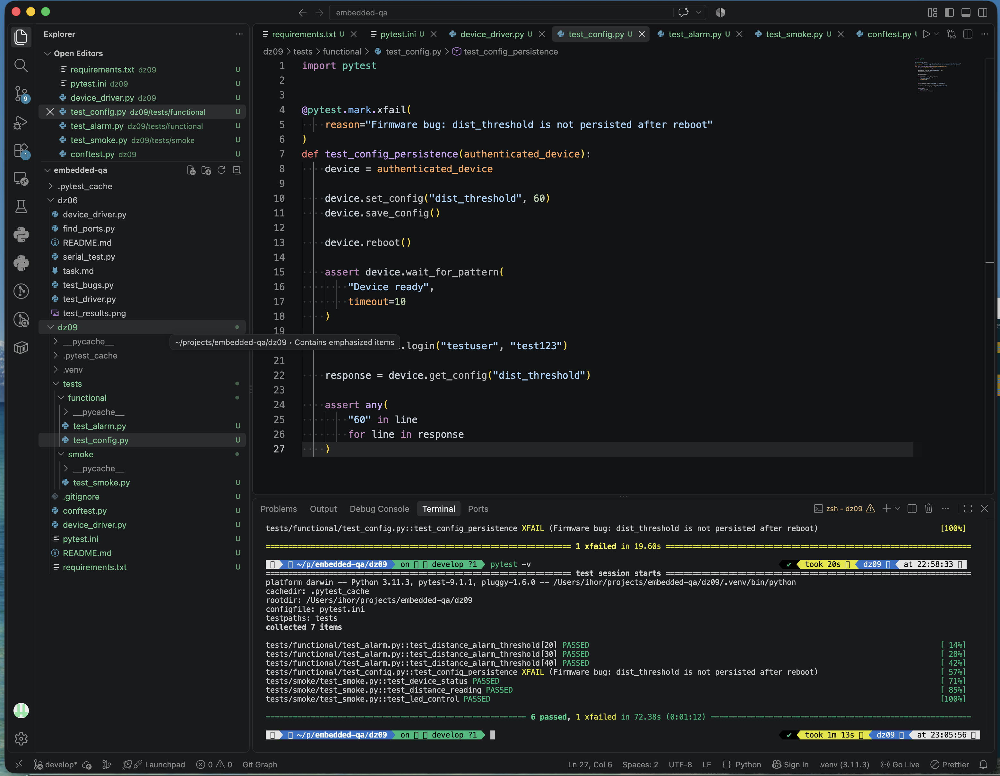

# DZ-09 — ESP32-S3 Pytest Test Framework

## Overview

Automated test framework for ESP32-S3 firmware using Python, pytest, and UART communication.

The framework includes:
- pytest fixtures for device setup and authentication
- automatic UART port discovery by VID
- smoke tests
- parameterized functional alarm tests
- configuration persistence testing
- known firmware defects documented with `pytest.mark.xfail`

## Project Structure

```text
dz09/
├── conftest.py
├── device_driver.py
├── pytest.ini
├── README.md
├── requirements.txt
└── tests/
    ├── smoke/
    │   └── test_smoke.py
    └── functional/
        ├── test_alarm.py
        └── test_config.py
```

## Setup

Create and activate a virtual environment:

```bash
python3 -m venv .venv
source .venv/bin/activate
```

Install dependencies:

```bash
pip install -r requirements.txt
```

## Hardware Connection

The ESP32-S3 communicates through an external FT232R USB-UART adapter.

The serial port is discovered automatically using the FTDI VID:

```text
VID: 0x0403
```

No serial port name is hardcoded in the tests.

## Running Tests

Run the complete test suite:

```bash
pytest -v
```

Expected result with the current firmware:

```text
6 passed, 1 xfailed
```
### Test Results

Final `pytest -v` execution: **6 passed, 1 xfailed**.



## Test Coverage

### Smoke tests

`tests/smoke/test_smoke.py`

- device status check
- distance reading check
- LED control check

### Functional alarm tests

`tests/functional/test_alarm.py`

Parameterized distance alarm threshold checks using multiple threshold values.

### Configuration persistence

`tests/functional/test_config.py`

The test changes `dist_threshold`, saves the configuration, reboots the device, waits for the firmware to become ready, authenticates again, and verifies the stored value.

## Known Firmware Issue

`dist_threshold` is not persisted after reboot.

The persistence test is therefore explicitly marked with:

```python
@pytest.mark.xfail(
    reason="Firmware bug: dist_threshold is not persisted after reboot"
)
```

## Boot Readiness Note

The assignment specifies waiting for:

```python
wait_for_pattern("App started")
```

However, the provided firmware does not output `App started` after reboot.

The actual firmware boot-ready message is:

```text
[Boot] Device ready
```

Therefore, the persistence test uses:

```python
wait_for_pattern("Device ready")
```

No `time.sleep()` is used for reboot synchronization.