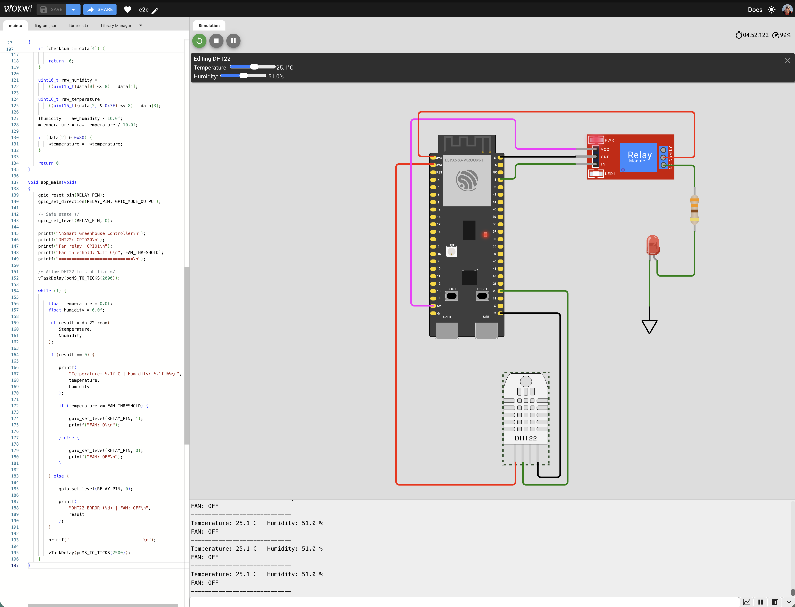
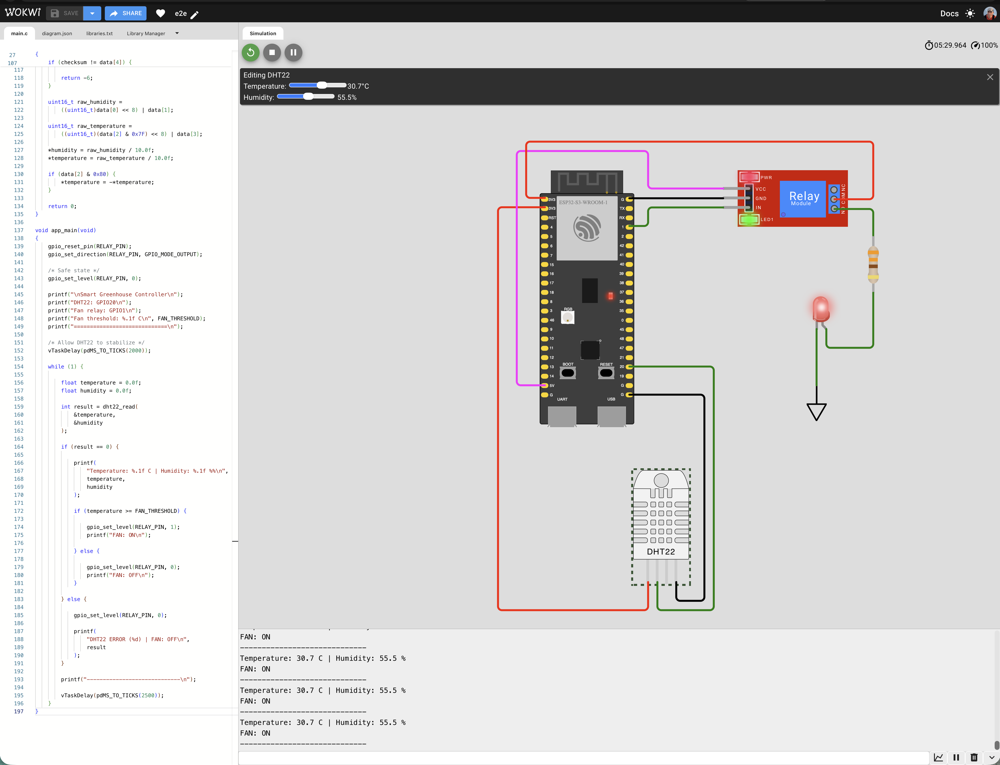

# Smart Greenhouse Controller — Wokwi Simulation

## Overview

This Wokwi simulation demonstrates one of the key scenarios of the
Smart Greenhouse Controller: automatic ventilation control based on
air temperature.

The simulated system consists of:

- ESP32-S3 as the Device Under Test (DUT)
- DHT22 temperature and humidity sensor
- relay module controlling the ventilation output
- LED representing the ventilation fan

## Tested Scenario

**UC-001 — Overtemperature / Automatic Fan Control**

The ESP32-S3 periodically reads the temperature from the DHT22 sensor.

Control logic:

- Temperature < 30 °C → FAN OFF
- Temperature >= 30 °C → FAN ON

The LED represents the ventilation fan state.

## Test Results

### Normal Temperature — Fan OFF

Test temperature: **25.1 °C**

Expected result:

- relay inactive
- fan state: OFF
- LED: OFF

Result: **PASS**

### High Temperature — Fan ON

Test temperature: **30.7 °C**

Expected result:

- relay active
- fan state: ON
- LED: ON

Result: **PASS**

## Wokwi Project

Simulation link:

### [Open Smart Greenhouse Controller in Wokwi](https://wokwi.com/projects/475723601478021121)
