# DZ14 Test Report

## Part A — Wi-Fi Automated Testing

### Test Environment

- Device: ESP32-S3 DevKit
- Firmware: `station_WiFi`
- Test framework: pytest
- Communication: UART / pyserial
- Wi-Fi network: 2.4 GHz mobile hotspot
- Wi-Fi credentials are provided through environment variables and are not stored in the repository.

Before running the tests, the test Wi-Fi credentials must be configured:

```bash
export TEST_WIFI_SSID="your_ssid"
export TEST_WIFI_PASSWORD="your_password"
```

### Automated Test Results

Command used to run the tests:

```bash
pytest -v
```

Result:

```text
collected 7 items

tests/wifi/test_wifi_negative.py::test_wrong_password PASSED
tests/wifi/test_wifi_negative.py::test_short_password PASSED
tests/wifi/test_wifi_negative.py::test_nonexistent_ssid PASSED
tests/wifi/test_wifi_positive.py::test_scan_finds_networks PASSED
tests/wifi/test_wifi_positive.py::test_connect_success PASSED
tests/wifi/test_wifi_positive.py::test_disconnect XFAIL
tests/wifi/test_wifi_positive.py::test_credentials_survive_reboot PASSED

6 passed, 1 xfailed in 140.25s
```

### Evidence

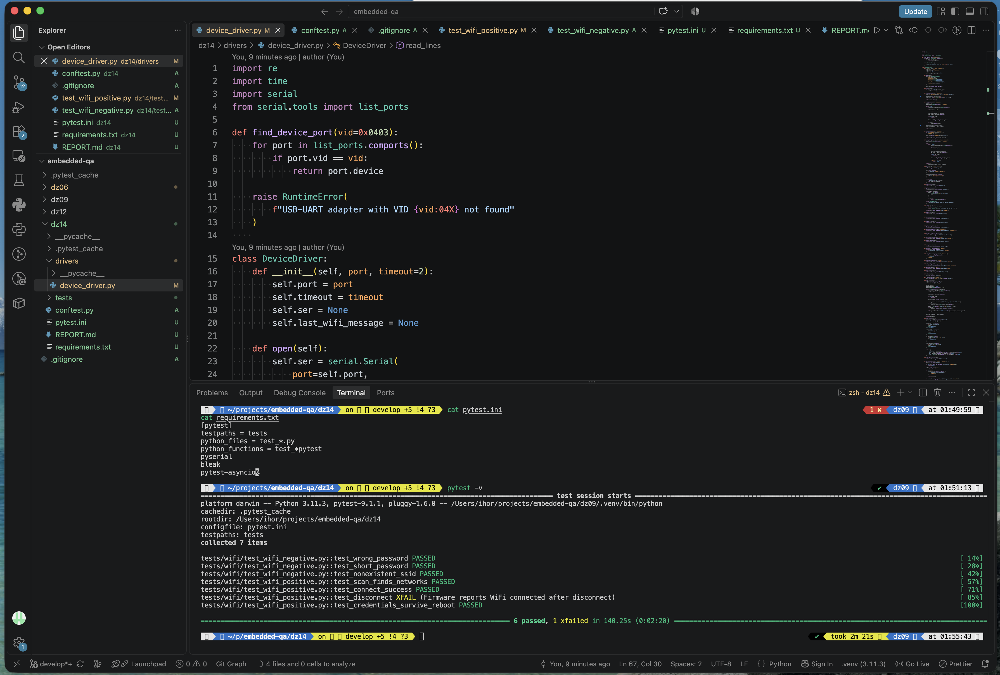

### Wi-Fi Test Summary

- Wi-Fi scan: PASS
- Connection with valid credentials: PASS
- Connection with wrong password: PASS
- Short password validation: PASS
- Nonexistent SSID handling: PASS
- Saved credentials after reboot: PASS
- Wi-Fi disconnect: XFAIL — firmware issue

### Bug Report — Wi-Fi Disconnect Status

**Test:** `test_disconnect`

**Steps to reproduce:**

1. Connect the device to a valid Wi-Fi network.
2. Execute the `disconnect` command.
3. Execute the `status` command.

**Expected result:**

The device should report that Wi-Fi is disconnected. No active SSID, IP address, or RSSI should be reported.

**Actual result:**

After the `disconnect` command, the firmware may still report:

```text
WiFi: connected
SSID:
IP: 0.0.0.0
RSSI: 0 dBm
```

The firmware may also output:

```text
Haven't to connect to a suitable AP now!
```

The device therefore reports an inconsistent Wi-Fi state after disconnecting.

**Result:** FAIL — firmware issue.

The automated test is marked as `xfail`:

```python
@pytest.mark.xfail(
    reason="Firmware reports WiFi connected after disconnect"
)
```

## Part B — BLE Testing

### Test Environment

- Device: ESP32-S3 DevKit
- Firmware: `Bluedroid_GATT_Server`
- BLE device name: `SENTRY-BLE`
- Manual BLE testing: nRF Connect
- UART monitoring: 115200 baud via FT232R
- Automated BLE testing: pytest + bleak

### Manual BLE Test Results

#### 1. BLE Scan — PASS

**Requirement:** FR-A1

**Action:** Scanned for BLE devices using nRF Connect.

**Expected:** Device `SENTRY-BLE` is visible and advertising.

**Actual:** `SENTRY-BLE` was successfully discovered with RSSI approximately -41 dBm.

**Result:** PASS

**Evidence:**

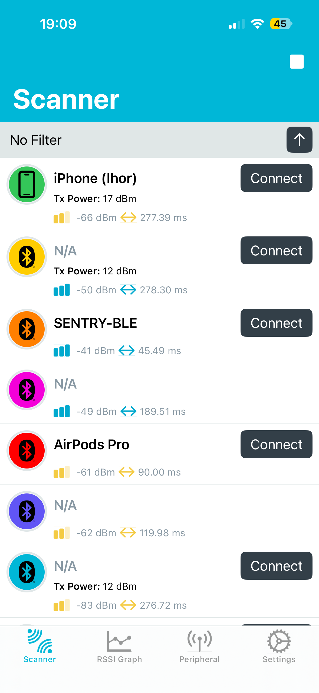

---

#### 2. Connect and Service Discovery — PASS

**Requirements:** FR-A3, FR-G1, FR-G3

**Action:** Connected to `SENTRY-BLE` and performed service discovery.

**Expected:** Heart Rate service `0x180D` and Automation IO service `0x1815` are available. Automation IO contains the LED and RELAY characteristics defined in the PRD.

**Actual:** Both required services and characteristics were discovered. UART also reported a successful BLE connection.

**Result:** PASS

**Evidence:**

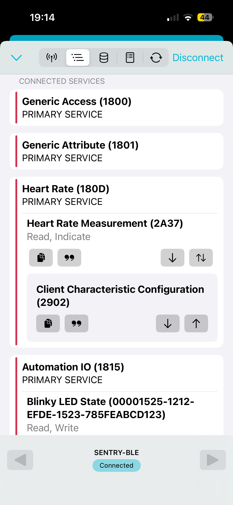

---

#### 3. Heart Rate Indications — PASS

**Requirements:** FR-G1, FR-G2

**Action:** Subscribed to indications from Heart Rate Measurement characteristic `0x2A37`.

**Expected:** Heart rate values update approximately once per second and remain within 60–80 bpm.

**Actual:** Heart rate indications were received correctly. A normal value of 67 bpm was observed.

**Result:** PASS

**Evidence:**

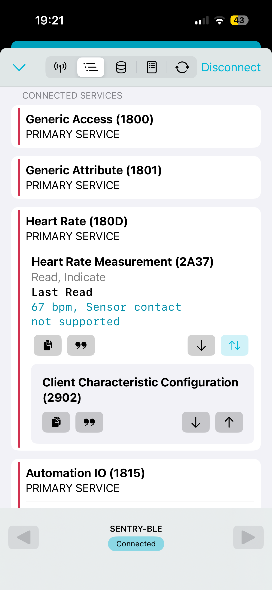

---

#### 4. Heart Rate Spike — PASS

**Requirement:** FR-C3

**Action:** Executed the UART command `hr spike` while subscribed to Heart Rate indications.

**Expected:** Heart rate temporarily increases to approximately 190–199 bpm.

**Actual:** A heart rate value of 198 bpm was observed in nRF Connect.

**Result:** PASS

**Evidence:**

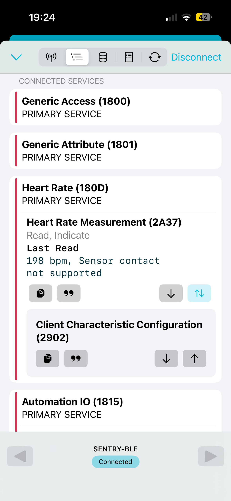

---

#### 5. LED Control via BLE — PASS

**Requirement:** FR-G4

**Action:** Wrote `01` and `00` to the LED characteristic.

**Expected:** `01` turns the LED on and produces `LED ON!` in UART. `00` turns the LED off and produces `LED OFF!`.

**Actual:** The onboard green LED reacted correctly and the corresponding UART messages were received.

**Result:** PASS

**Evidence:**

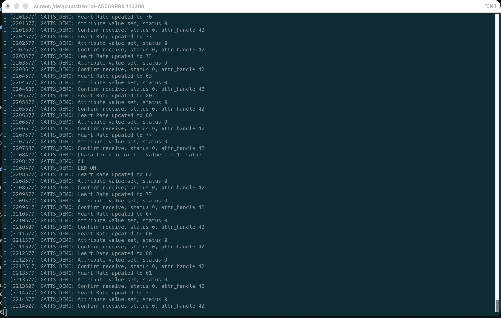

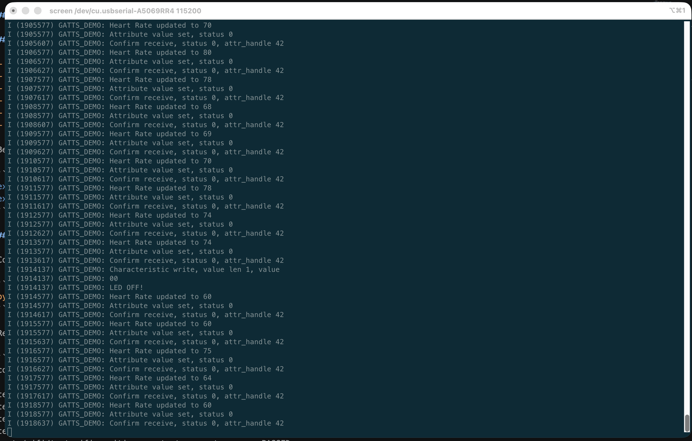

---

#### 6. Relay Control via BLE — PASS

**Requirement:** FR-G4

**Action:** Wrote `01` and `00` to the RELAY characteristic.

**Expected:** The relay reacts to both commands and UART reports `RELAY ON!` and `RELAY OFF!`.

**Actual:** The relay module indicator changed state and the corresponding UART messages were received.

**Result:** PASS

**Evidence:**

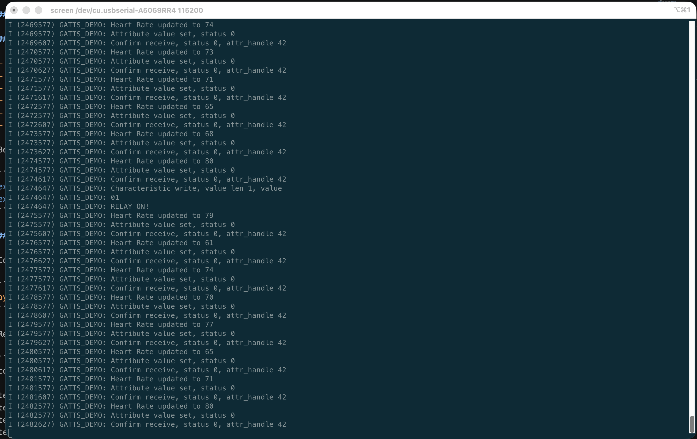

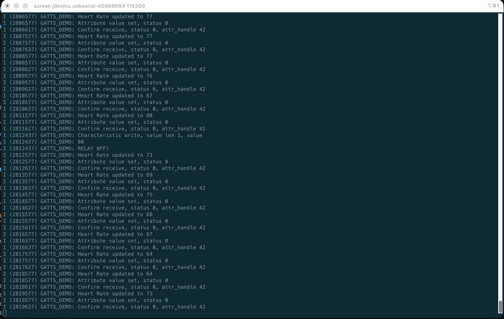

---

#### 7. Read After Write — PASS

**Requirement:** FR-G5

**Action:** Read the LED and RELAY characteristics after writing `01` and `00`.

**Expected:** Read returns the current value written to each characteristic.

**Actual:** The LED and RELAY characteristics returned the expected ON/OFF states after the corresponding writes.

**Result:** PASS

**Evidence:**

LED ON — write/read:

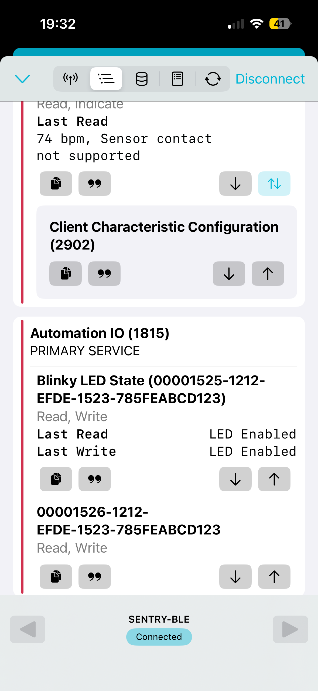

LED OFF — write/read:

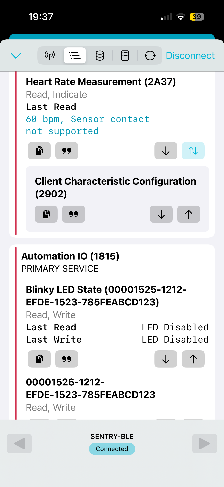

RELAY ON — write/read:

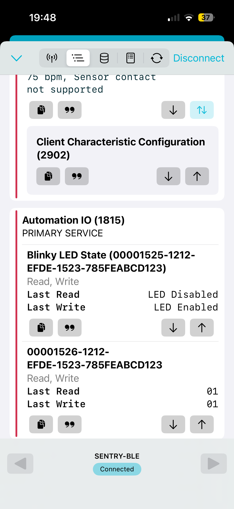

RELAY OFF — write/read:

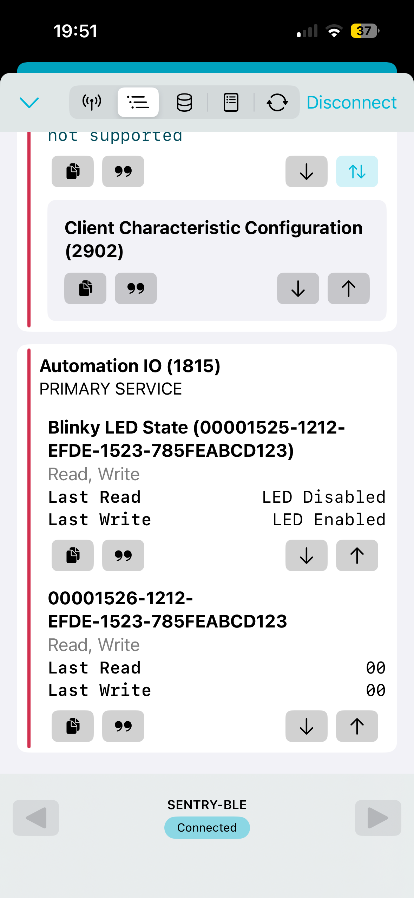

---

#### 8. Control Channel Conflict — PASS

**Requirement:** FR-G5

**Action:**

1. Wrote `01` to the LED characteristic over BLE.
2. Confirmed that the LED turned on.
3. Executed `led off` through UART.
4. Read the LED characteristic again over BLE.

**Expected:** BLE read returns the actual current LED state (`00`) after the state was changed through UART.

**Actual:** The last BLE write showed LED Enabled. After `led off` through UART, the subsequent BLE read showed LED Disabled.

**Result:** PASS

**Evidence:**

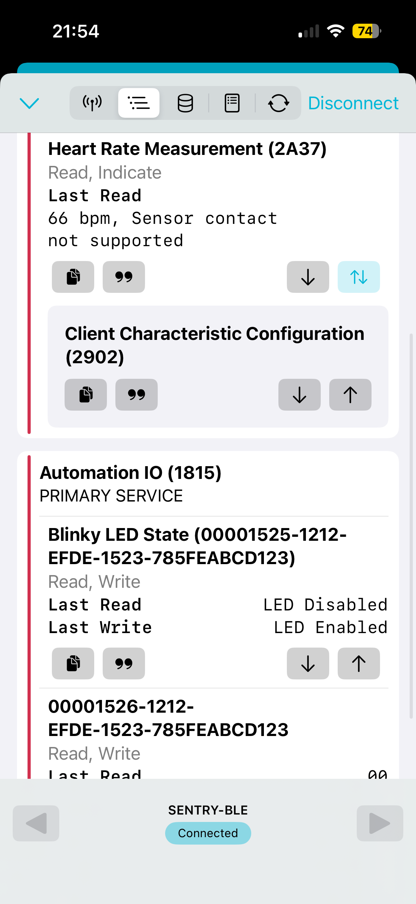

---

#### 9. BLE Reconnect — PASS

**Requirements:** FR-A2, FR-A3

**Action:** Disconnected from the device, scanned for it again, and reconnected.

**Expected:** UART reports `Disconnected`, advertising restarts, `SENTRY-BLE` becomes visible in the scanner again, and a new connection succeeds.

**Actual:** UART reported the disconnection and successful advertising restart. `SENTRY-BLE` appeared in the scanner again and the subsequent connection succeeded.

**Result:** PASS

**Evidence:**

UART disconnect and advertising restart:

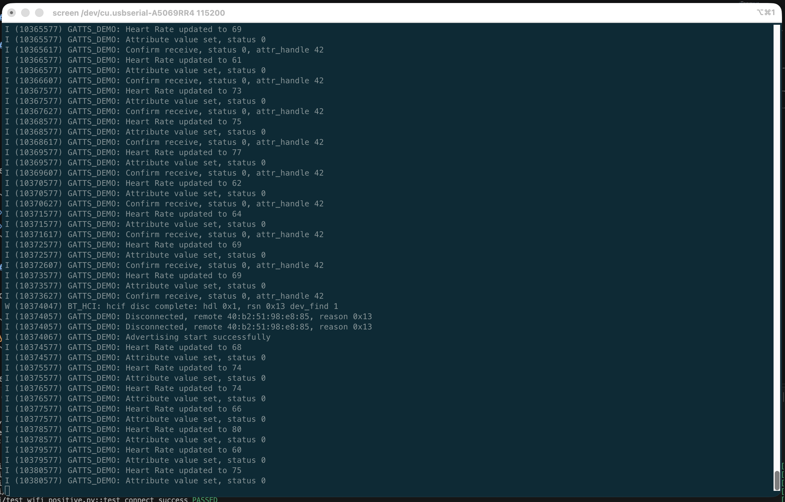

SENTRY-BLE visible again after disconnect:

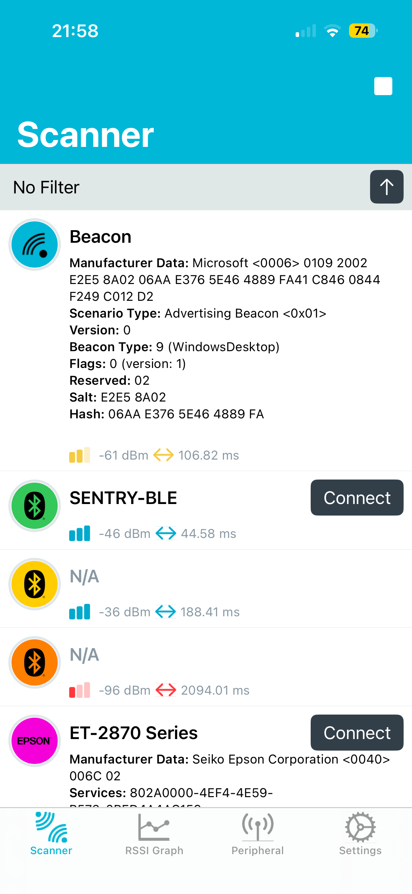

Successful reconnection:

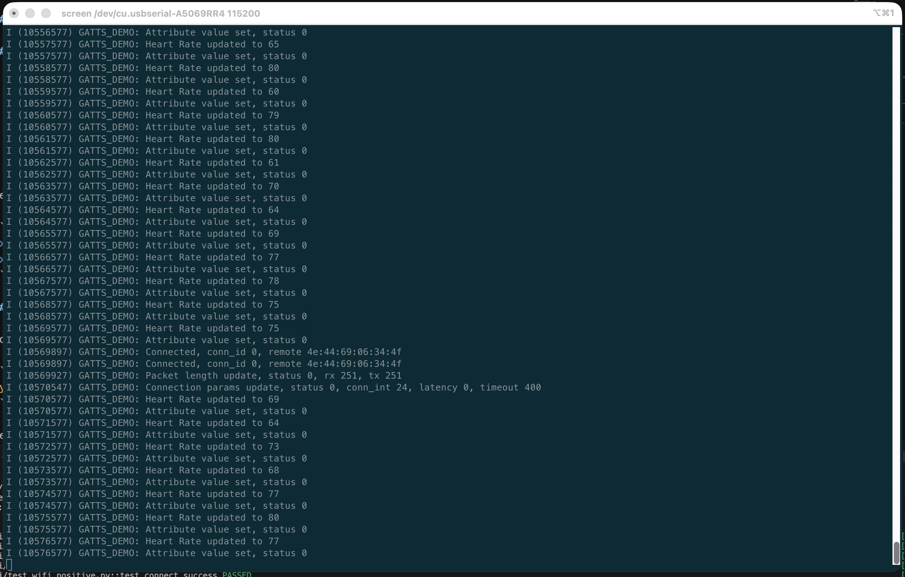

### BLE Automated Test

**Test:** `tests/ble/test_ble_smoke.py::test_ble_led_dual_channel`

The automated smoke test verifies:

- discovery of `SENTRY-BLE` using BleakScanner;
- BLE connection;
- write `0x01` to the LED characteristic;
- UART confirmation `LED ON!`;
- write `0x00` to the LED characteristic;
- UART confirmation `LED OFF!`;
- BLE disconnection.

Command:

```bash
pytest -v tests/ble/test_ble_smoke.py
```

Result:

```text
tests/ble/test_ble_smoke.py::test_ble_led_dual_channel PASSED [100%]

1 passed in 7.68s
```

**Result:** PASS

**Evidence:**

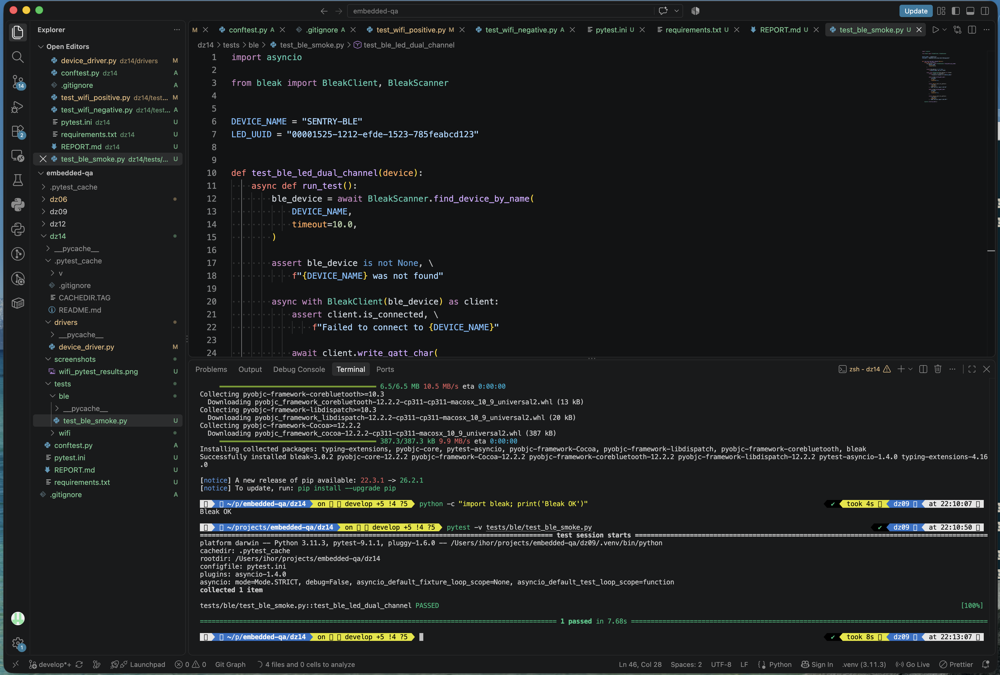

### BLE Bugs

No firmware deviations from the tested BLE requirements were observed.
